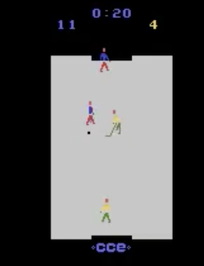

# Neuroevolution for Reinforcement Learning

Replication of [Uber AI Labs Neuroevolution paper](https://arxiv.org/pdf/1712.06567.pdf).

This is a complete rewrite of the code from OpenAI, Uber. The worker is implemented in tensorflow, and uses gym.
Workers communicate directly with a master Go server using gRPC. See `worker/` and `master/` for the code and
`proto/` for the generated stubs.

Click the images below to see the trained agents in action. To my knowledge, this ice-hockey agent is *state-of-the-art.*

## Deployment

Deployment is done on AWS with cloudformation, allowing for one click deployment of an experiment with 100s of
workers, see `deploy/` for details.

Master is deployed on a dedicated EC2 instance, workers are provisioned on a spot fleet with 180-720 discrete cpu
cores. Both master and worker are packaged as docker images [available here](http://dockerhub.com/r/cshenton/neuro).

As far as HPC experiments go, this one is in the affordable range. Reaching 1 billion frames requires around
900 cpu core hours, which costs between $25-75USD on the AWS spot market. However, running the full atari suite
up to 4 billion frames would cost some thousands of dollars.

## Discussion

The simple master-worker architecture made this a pleasure to implement, and cpu load on the master indicates
that it could seamlessly handle 200,000+ workers if need be (and more on a larger server). However I have some
observations on the limitations of this method for training policy networks:

- Vanilla GA is very susceptible to stochastic rewards
    - The elite run won't be the best policy
    - A lucky run from a poor policy can remain the elite for many generations
- As seeds get longer, network construction starts to dominate evaluation costs
    - Eventually this will crossover serialisation costs, quicker for smaller nets

Some performance enhancements that could be made to this implementation include.

- Compiling tensorflow to use AVX2, FMA instructions.
- Making sure docker doesn't share floating point cores between containers.

## ToDo

- Experiment 2
- Training Graphs
- Videos
- Utilities for trying out policies

### Some policies

#### FROSTBITE

[4070460811, 2393459932, 3391677529, 3126527182, 1530841827, 551825296, 2788280626, 3259895649, 491621571, 1975069066, 2436286981, 1561675863, 1783350318, 1327606738, 2368546632, 1861319266, 2926076564, 3244028662, 770972465, 682803462, 4187104692, 1531762673, 227312423, 687820495, 2693349394, 3452885796, 1637163948, 1847219188, 3239734781, 546358686, 3663099671, 2948785697, 2098781916, 3154979704, 3257521261, 4184203103, 1546417913, 1190962580, 1519291590, 4142039378, 2791828317, 794877055, 1407797410, 1212357677, 2357465736, 2331237694, 155839330, 3730261797, 2730616978, 3595209610, 3230716243]

#### ICE HOCKEY

[1193660004, 1040827018, 2653379460, 173080, 3797966230, 3308022337, 3054459776, 219559594]

[1193660004, 1040827018, 2653379460, 173080, 3797966230, 3671555679, 1574614964, 2809103031, 2989449463, 2587665506, 1071551256, 3083473754, 224017235, 3009524750, 1784945413]